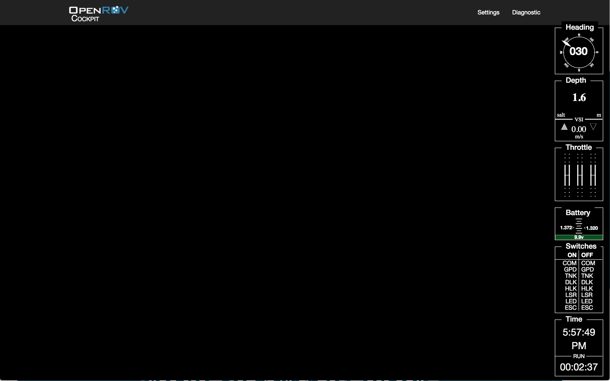

This theme is a spartian black and white theme for controlling the ROV.  It features SVG based HUD gauges along the right side of the screen but leaves the rest of the screen for video.

This is based on the post by  @estackpole here: https://forum.openrov.com/t/more-cockpit-ui-philosophy/1910

CSS framework used: BootStrap v3

Todo:
---
-[ ] Add the status icons along the top.
